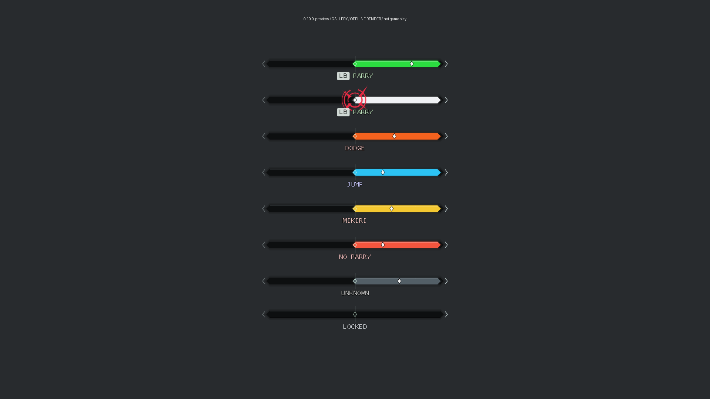
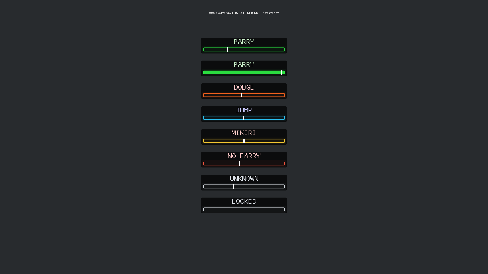
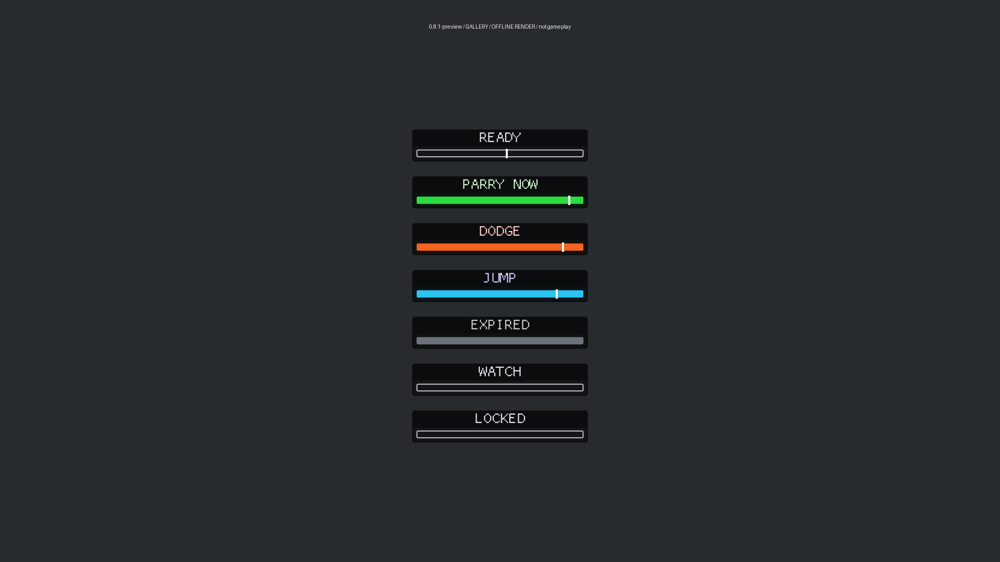

# Reference-style HUD preview 0.10.0



The current default is a 480 x 18 reference-pixel rail at `(0.5, 0.16)` of the
playable viewport, beneath the enemy's top posture bar. The right segment is
green for parryable wind-up and the diamond approaches the fixed center gate.
The white rail and original red strike emblem indicate an active parryable
attack phase, not measured contact or a successful deflect. Other responses
retain their colored segment and clear caption. The small LB badge supports
L1/RMB alternatives. No large enclosing background panel is drawn.

The editable [SVG emblem](../assets/ui/strike-emblem.svg) is exported from the
same vector geometry used in-game. The gallery stacks states for inspection;
only one rail appears in normal use. Reduced-flash mode keeps the response hue
and suppresses white/red. See [validation](validation-0.10.0.md).

## Historical 0.8.1 and 0.9.0 layout

0.9.0 retains this raised geometry and uses [incoming response labels](incoming-attacks.md)
by default. The states described below belong to optional legacy timing mode.



The former default cue was fixed above the configured area for Wolf's bottom posture
bar. Its 320 x 14 reference-pixel lane, 30-pixel label and full glow bounds scale
with the fitted playable viewport. It no longer follows Wolf's jumps or crouches.
The normalized anchor `(0.5, 0.81)` and reserved posture-band top `0.85` are a
**configured placement fallback**, not detected game HUD geometry. Full bounds
stay at least `posture_gap` (default 12 reference pixels) above that reserved band.
The actual bar's location and UI scale still need live verification.



The gallery stacks states for inspection; live gameplay displays one cue at the
configured bottom anchor. Earlier validation screenshots remain historical.

| State | Label and shape | Meaning |
| --- | --- | --- |
| Preparation | READY, hollow lane | Anticipate the selected hit; not an instruction to press |
| Actionable parry | PARRY NOW, filled green lane | Estimated or compatible calibrated defensive press interval |
| Actionable dodge | DODGE, filled orange lane | Classified defensive evade response; direction is not predicted |
| Actionable jump | JUMP, filled blue lane | Classified low sweep response |
| Expired | EXPIRED, gray lane | Press interval ended; no actionable glow/pulse persists |
| Neutral | LOCKED, hollow neutral lane | Fresh lock with no eligible timing instruction |
| Neutral attack | WATCH, hollow neutral lane | Known attack phase without a verified response; no press instruction |
| Hidden | no cue | Missing/stale/invalid required observations, hidden setting, lost focus or unsupported layout |

Labels remain bright with a dark outline independently of fill opacity. Both
word and shape distinguish READY from action. Pulse intensity/duration and
reduced flash are configurable. A preferred-time pulse requires an evidence
profile and a witnessed valid crossing; shipped activation estimates have no
preferred pulse. Decoration never extends the press label or actionable color.
See [the timing model](parry-cue.md) and [all configuration bounds](configuration.md).

F6/F7 persist vertical changes, F8 toggles the gameplay HUD, F9 toggles separate
research, and F10 resets offsets. Focused fresh presses pass through to the game.
No gameplay preview is synthesized without lock. Optional overhead mode projects
player root +1.55 world units and uses the same portable timing decision; invalid
or offscreen projection suppresses it. Fixed placement needs no player projection.
When camera aspect is unavailable, an explicit centered 16:9 fallback is logged.

## Actual synthetic layout checks

The 0.8.1 recording comparison and current checks are in
[validation-0.8.1](validation-0.8.1.md). A dark backing and larger type make the
neutral lock visible; a moving white marker shows mapped preparation/action.
Fresh lock reads retain LOCKED even if animation captures fail or expire.
The matrix below records the preceding 0.8.0 checks and remains historical.

Shared ImGui geometry was emitted and every vertex checked against full bounds
and the fitted viewport. These checks exercise configured geometry, **not the
actual game posture bar, UI scale, fullscreen or borderless presentation**.

| Surface / setup | Checked synthetic state | Result |
| --- | --- | --- |
| 1280x720 | READY; also scale 0.5 PARRY NOW | bounds and mesh pass |
| 1920x1080 | six-state gallery; no-camera 16:9 fallback | bounds and mesh pass |
| 2560x1440 | DODGE | bounds and mesh pass |
| 3840x2160, scale 1.5 | PARRY NOW | bounds and mesh pass |
| 3440x1440, 16:9 camera | JUMP in centered 2560x1440 viewport | bounds and mesh pass |
| 5120x1440, 16:9 camera | EXPIRED in centered 2560x1440 viewport | bounds and mesh pass |
| 1920x1200, 16:9 camera | READY in letterboxed 1920x1080 viewport | bounds and mesh pass |
| 1920x1080, 21:9 camera | LOCKED in fitted wide viewport | bounds and mesh pass |
| Inset 960x540 viewport, max label/glow/offset fixtures | portable geometry tests | bounded clamp passes |
| 180x90 unsupported surface | portable geometry test | suppressed |

Outputs, meshes and atlas files are local under `dist/review-0.8.0/layout/`.
Representative 720p, gallery and ultrawide images were visually inspected.
A viewport height below 540 reference pixels or insufficient full-bound space
suppresses the cue. Config offsets are clamped inside the playable viewport and
reserved band. Camera fitting does not detect arbitrary user HUD mods or UI scaling.

## Reproduce

```powershell
cargo test --locked --offline --target x86_64-pc-windows-msvc
cargo run --locked --offline --target x86_64-pc-windows-msvc --example cue-layout -- dist/review-0.8.0/layout/1080-gallery --gallery --display 1920 1080
python scripts/render-cue-layout.py dist/review-0.8.0/layout/1080-gallery
python scripts/test-attack-timings.py
python scripts/update-move-coverage.py --check
```

`--state ready|parry|dodge|jump|expired|locked`, `--display W H`, `--scale`,
`--aspect` and `--no-camera` select offline scenarios. No hooks or gameplay
input are used. Pillow is a development-only rasterizer under `dist/video-tools`.
The installed DLL requires none of those extraction/rendering tools.

## Coverage and validation limits

The exact [coverage ledger](boss-move-coverage.md) has 2,161 phases across 54 models,
450 parry estimates, 39 dodge phases and 58 jump phases. These are not unique
human moves. Ogre's current-batch selection and Ape response mappings remain;
other forms are explicitly unresolved. Mikiri lacks eligible-thrust/capability
evidence. Special counters, attack-back and automatic retaliation are outside
implemented support. Shared archives do not establish another form's behavior.

The DLL logs source/read/publication/render clocks and observation/capture IDs,
owner generations, intervals, calibration references, pulse decisions and layout.
Visible presentation, actual input, contact and confirmed successful outcomes
remain unobserved; effect 105010 alone cannot fill them. Display mode must be
recorded in the trial metadata, separate from surface size. See
[WORK-STATUS](WORK-STATUS.md) and [the gameplay checklist](../tests/manual/gameplay-checklist.md).
