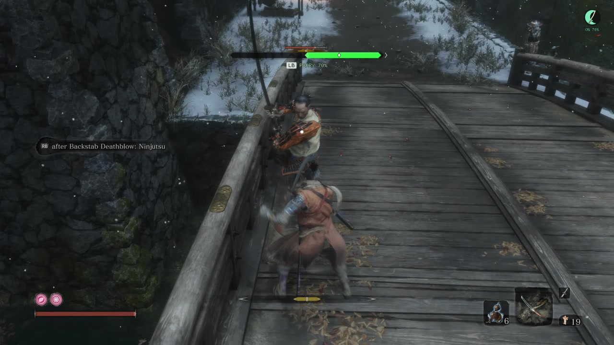
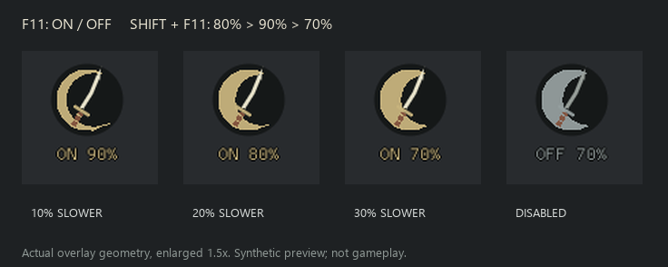

# HUD behavior (0.12.4-preview)

The top-center rail shows the locked enemy's incoming attack phase. The
upper-right crescent shows enemy-speed practice status. They communicate
separate things: a PARRY cue can remain visible when practice is waiting or
needs attention.



*Actual gameplay at 00:38.500 in the September 18 recording.
[See the animated sequence, other states and capture details](screenshots.md).*

## Read the attack rail

The default rail is 480 × 18 reference pixels at `(0.5, 0.16)` of the playable
viewport, configured below the enemy's top posture bar. It scales with the
viewport; this is fixed placement, not automatic detection of the game's UI.

During a parryable wind-up, the rail is green and the diamond approaches the
center gate. A white segment and red strike emblem mark the active parryable
phase. They do not identify exact weapon contact or confirm a successful
deflect. Default incoming mode does not require the enemy to be within reach.

| Caption | Meaning |
| --- | --- |
| PARRY | The classified phase permits deflection. |
| DODGE | The classified phase is a grab; no safe dodge direction is predicted. |
| JUMP | The classified phase is a low sweep. |
| MIKIRI | The classified thrust has an explicit supported counter route. |
| NO PARRY | Deflection is disabled; no specific alternative is established. |
| UNKNOWN | The attack is known but its response is unresolved. |
| LOCKED | The target is fresh but no current attack phase is available. |
| PRACTICE | Practice is armed and waiting for an eligible phase. |
| PARRY 70% / PRACTICE 70% | The controller reports an applied speed for this target; the second caption is used when the rail is neutral, such as with hints disabled. |

The percentage follows the configured speed; 70% is the example visible in the
new video. DODGE, JUMP, MIKIRI, NO PARRY and UNKNOWN retain their own colors and
labels. The clip illustrates PARRY, rather than demonstrating every response.

Mikiri hints assume the skill is unlocked. Set `mikiri = false` to show PARRY
for supported deflectable thrusts instead. Set `reduced_flash = true` to keep
the response color and suppress the white/red transition.

## Read the practice moon

**F11** toggles practice for this process. **Shift+F11** switches and saves
**80% → 90% → 70% → 80%** without changing whether practice is armed.
Practice starts off after a restart.

| Appearance | Meaning |
| --- | --- |
| Gray OFF + percentage | Disabled; the percentage is the selected speed. |
| Gold ON + percentage | Armed and waiting. |
| Jade ON + percentage | Applied override on a fresh matching target. |
| Amber ON + percentage and ! | Unavailable, paused, unsupported or pending cleanup; F9 gives details. |

The 90% moon is thin, 80% is wider and 70% is fullest. The moon remains visible
without a lock and while practice is off, independently of attack hints and
rail offsets. It follows the playable viewport and HUD scale/opacity.
**F8 hides the HUD and disarms practice**; focus loss hides the HUD temporarily.
See [practice behavior](enemy-speed-practice.md) for eligibility and cleanup.

## Other modes and design references

Set `incoming_cues = false` only to use the separate legacy estimated timing
mode, which adds READY, PARRY NOW, WATCH and EXPIRED states. See
[legacy timing](parry-cue.md) and [configuration](configuration.md).

The editable [strike emblem](../assets/ui/strike-emblem.svg) uses the same vector
geometry as the live HUD. The observer loads no texture for it.

<details>
<summary>Synthetic reference: all three moon presets</summary>



This is a renderer-generated comparison, not a gameplay screenshot. Older
designs are in the [historical visual archive](screenshots.md#historical-synthetic-previews).

</details>

## Reproduce a synthetic render

Run these from Developer PowerShell to render the current implementation:

```powershell
cargo run --locked --offline --example cue-layout --target x86_64-pc-windows-msvc -- dist/review-0.12.4/layout/practice --incoming-gallery --practice --speed 0.7
cargo run --locked --offline --example cue-layout --target x86_64-pc-windows-msvc -- dist/review-0.12.4/layout/no-hints --state incoming-parry --practice --no-hints --speed 0.7
python scripts/render-cue-layout.py dist/review-0.12.4/layout/practice
python scripts/render-cue-layout.py dist/review-0.12.4/layout/no-hints
```

These previews check drawing and layout bounds. The
[gameplay images](screenshots.md) show the HUD in the recorded encounter.
Measured slowdown, contact/input timing and lifecycle checks are tracked in
[current validation](validation-0.12.4.md) and the
[gameplay checklist](../tests/manual/gameplay-checklist.md).
