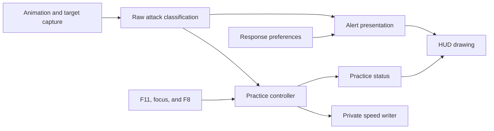

# Architecture and ownership

The project is a Rust Windows x64 DLL. It reads Sekiro game state, classifies a
locked enemy's attack, and submits a DX11 HUD through hudhook. Optional practice
mode temporarily writes the locked enemy's animation speed after the player
enables it with F11.

Read [how one attack becomes a cue](../how-it-works.md) first if you need the
runtime flow without implementation detail.

## Runtime flow

```text
DLL initialization -> identity checks -> hooks and worker
animation batch -> validated target -> raw attack phase
raw attack phase -> alert policy -> HUD decision -> DX11 draw commands
raw attack phase -> practice policy -> owned speed write or restoration
worker -> config reload, state publication, and bounded logs
```

The animation hook, worker, and renderer run on different schedules. Every
published observation carries a monotonic timestamp, owner identity, and
lifecycle generation so a later stage can reject stale state.

## Module ownership



| Module | Owns | Must not own |
| --- | --- | --- |
| `event_hook.rs`, `cue.rs` | Animation capture, target identity, camera reads, and freshness. | Alert preferences or speed writes. |
| `attack.rs` | NPC variation lookup, phase boundaries, and raw attack kind. | Config, HUD labels, or practice state. |
| `incoming.rs` | Default alert filtering and response labels. | Practice eligibility or memory writes. |
| `timing.rs` | Optional legacy occurrence, rate, interval, and pulse decisions. | Native reads or drawing. |
| `practice.rs` | Eligibility, speed ownership, application, restoration, and conflicts. | HUD decisions or display preferences. |
| `windows/practice.rs` | Native speed reads, writes, readback, and the practice audit log. | HUD drawing. |
| `windows/cue_draw.rs` | Geometry, text, colors, and reported practice status. | Game facts or memory writes. |
| `windows/diagnostics.rs` | Worker orchestration, shared snapshots, config work, and logs. | Deriving practice eligibility from HUD output. |
| `config.rs` | Schema, defaults, bounds, reload, migration, and atomic saves. | Render calls. |
| `lifecycle.rs` | Cross-thread invalidation generation. | Game reads or UI policy. |

`attack::classify` returns a raw `Phase`. A thrust remains a thrust even when
the player hides the Mikiri hint. `incoming.rs` owns the Mikiri-to-PARRY display
fallback. `practice.rs` consumes the raw phase and remains independent of that
choice.

## Capture and freshness

`src/cue.rs` reacquires the player, selected lock target, actor modules, health,
animation, and optional camera data. It validates ownership and selects the
current animation batch. Competing mapped tracks remain ambiguous. The reader
does not revive an older ring entry to fill a gap.

`src/event_hook.rs` copies completed animation batches before the game resets
their bounds. The detour is gated by the executable hash and expected function
bytes. Polling remains as a bounded fallback.

`LiveCue::current_lock` checks the validated lock age. `LiveCue::current` also
checks the original animation capture age. A fresh lock can therefore produce
LOCKED while stale animation data cannot produce an attack cue.

`src/lifecycle.rs` increments a generation on lock loss, owner change, animation
failure, target change, or F8 hide. The renderer checks the generation before it
submits draw commands. An already submitted command list cannot be revoked.

## Configuration and rendering

`src/config.rs` accepts at most 64 KiB of TOML and validates the whole file.
Invalid reloads keep the previous valid config. Hotkeys enqueue changes for the
worker. The renderer never reads or writes the config file.

`src/layout.rs` calculates a fitted viewport, safe margins, posture band, and
complete cue bounds. The default top anchor is configured placement. It does not
detect Sekiro's native posture bar.

`src/windows/cue_draw.rs` shares its geometry with `examples/cue-layout.rs`.
Synthetic renders verify drawing and bounds. They do not establish in-game
visibility or alignment.

The vendored hudhook DX11 backend records HUD commands on a private deferred
context. It submits them with host-state restoration. Empty draw data produces
no HUD GPU work. `tests/dx11-render-isolation.rs` covers state isolation on a
windowless WARP device.

## Practice writes

The worker runs practice outside the render mutex. The controller saves the
original speed and owns one target lease. Repeated samples do not stack the
multiplier. A new lease cannot begin while restoration remains pending.

The native adapter validates the same owner and last applied value before it
restores the exact original. It does not patch executable instructions, modify
the global clock, edit saves, or generate input.

Read [practice implementation and evidence](../research/practice-evidence.md)
before changing this boundary.

## Logs and evidence

Startup logs record the package version, loaded DLL hash, and executable hash.
Bounded CSV files record captures, render submissions, alerts, animation events,
practice transitions, and effect research.

A render row proves submission, not visible presentation. An alert row proves a
decision, not contact. A checked speed write proves readback, not the measured
animation rate. Logs never authorize behavior when a read or write fails.

Generated classifier evidence lives under [`research/data`](../research/data/).
Do not edit generated rows by hand. Use the matching generator and run its
`--check` mode.

## Match changes to checks

| Change | Required checks |
| --- | --- |
| Attack classification | Incoming generator check, incoming regression tests, and practice regressions. |
| Legacy timing tables | Timing generator check, timing regressions, and coverage update check. |
| Practice ownership or restoration | Practice regressions and a focused live cleanup trial. |
| Drawing or layout | Layout regressions, DX11 isolation, and the synthetic renderer. |
| Config parsing or saves | Config unit tests plus reload and external-edit checks. |
| Release behavior | [Release test procedure](release.md) and recorded gameplay evidence. |
