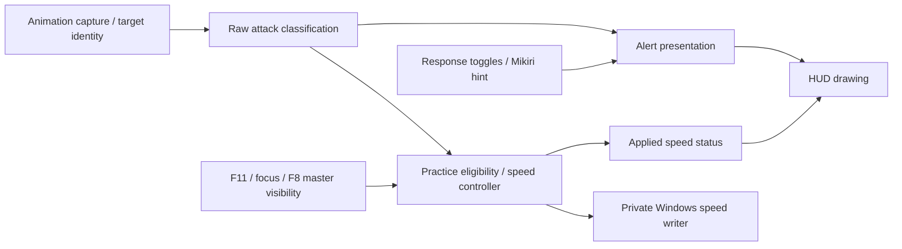

# Feature boundaries

As of 0.12.1, animation capture, attack facts, alert presentation and practice
speed have separate responsibilities. They share captured game data, not each
other's user-facing decisions.

| Module | Owns | Must not depend on |
| --- | --- | --- |
| `event_hook.rs`, `cue.rs` | Animation/target capture and freshness | Alert preferences or speed writes |
| `attack.rs` | NPC variant lookup, phase boundaries and canonical attack kind | Config, HUD decisions or practice policy |
| `incoming.rs`, `timing.rs` | Alert filtering, labels and optional legacy timing estimates | Practice enable state or speed writes |
| `practice.rs` | Eligible attack kinds, speed ownership, application/restoration policy | HUD `Decision`, alert toggles or display mode |
| `windows/practice.rs` | Private speed-write adapter, session and audit log | HUD drawing |
| `windows/cue_draw.rs` | Geometry, text and reported practice status | Speed eligibility or memory writes |
| `windows/diagnostics.rs` | Captures, shared read-only memory access and worker orchestration | Deciding practice eligibility from filtered HUD output |

`attack::classify` returns a raw `Phase` with an attack `Kind`: parryable, grab,
sweep, thrust, unparryable or unknown. It never converts a thrust into a parry
because the Mikiri hint is off. That fallback belongs only to `incoming.rs`.
The classifier preserves combo order and unresolved phases; it does not infer
whether a hit will reach Wolf.

Practice's `eligible(target, now)` takes no HUD decision or preferences. The
worker additionally requires an advancing/fresh capture and live context. F11
controls arming. F8 hiding remains a deliberate master shutdown; focus/lock loss
and cleanup requirements still apply. These explicit controls are the intended
connection between HUD visibility and practice.

`parry`, `dodge`, `jump`, `mikiri` and `incoming_cues` control alerts only.
For example, hiding parry hints can produce a neutral `PRACTICE 80%` caption
while the same classified sword attack continues at the applied practice rate.
The HUD reads the controller's status; it cannot start or stop a speed override.
Changes to raw animation data or attack mappings can still affect both features,
as intended. This is modular separation, not a separate process or thread.

When changing classification, run incoming and practice regression suites.
When changing speed ownership, run practice regressions. When changing drawing,
run layout/DX11 checks and the shared mesh preview. The preference-independence
regression covers all 32 response/hint/display-mode combinations on parryable,
thrust and sweep attacks and verifies that the existing speed write is neither
restored nor stacked. It also verifies F11-style disarming restores the original.

This architecture change does not establish live-gameplay correctness of the
experimental speed field. See [practice limits](enemy-speed-practice.md).
