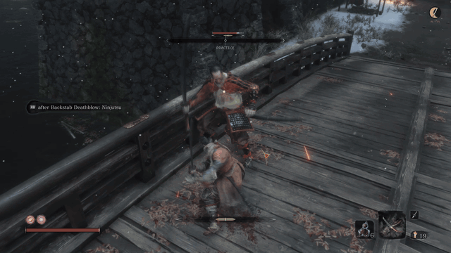
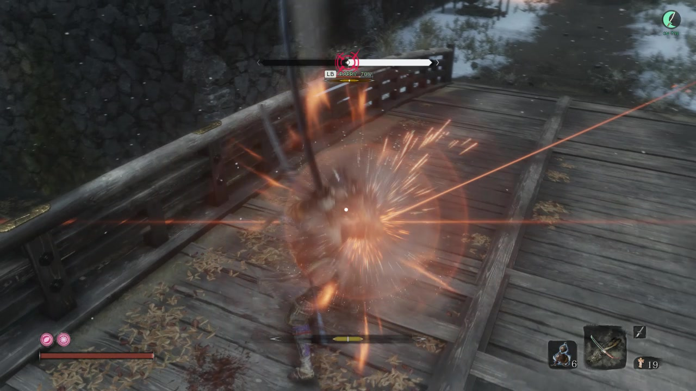
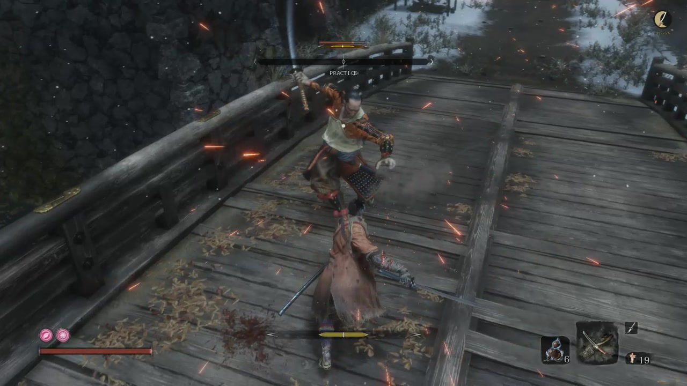
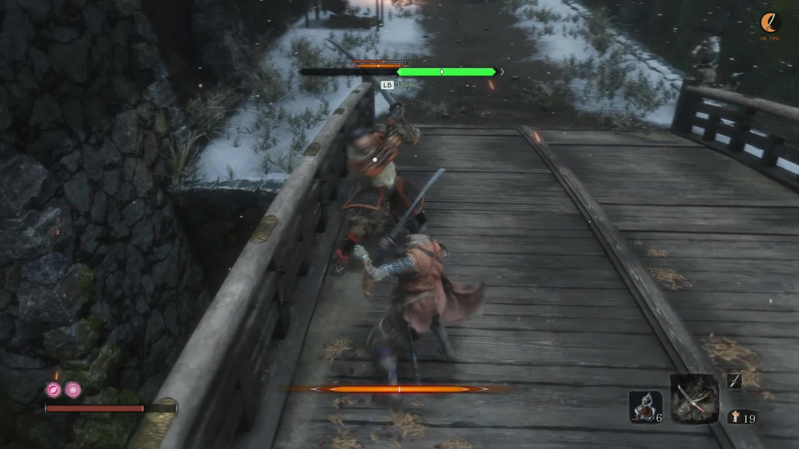

# Follow one attack through the HUD

These images come from the September 18, 2026 gameplay recording. The recording
shows the 0.12.4-preview HUD design at 70% practice speed. It does not show F9,
so it does not identify the loaded DLL hash.

## Watch the sequence

The clip covers 00:36.800 through 00:40.400 at normal playback speed.
Watch the moving diamond, then the white rail and red strike emblem, followed
by the return to `PRACTICE`. The stills below show the labels at full size.

## 1. Read the incoming attack

At 00:38.500, the green rail identifies a parryable phase. The diamond moves
toward the center as the animation advances. `LB` is the configured parry button
badge. You can change that label to `L1` or `RMB` to match your controls.

Look at the upper-right corner as well as the rail. `PARRY 70%` and the jade
`ON 70%` moon show that practice reports an applied speed on the locked target.
70% means 70% of the enemy's original animation speed, or 30% slower.

## 2. Recognize the active phase

At 00:39.500, the rail turns white and the red strike emblem appears. The HUD
marks the classified active phase. It does not establish the exact contact time
or prove a successful deflect. Neither the emblem nor the combat sparks mean
that your input succeeded. Use the enemy's movement to time your own input;
the observer does not press the button for you.

## 3. Distinguish armed from applied

At 00:40.000, the rail returns to `PRACTICE`. The gold moon means practice is
armed and waiting. It still says `ON 70%`, but the rail no longer has an applied
percentage. The selected speed is not continuously applied. Eligible attacks,
ordinary movement, and recovery can produce different practice states.

You do not need to press F11 again between attacks. Gold means the session is
already armed and waiting for the next eligible phase.

## 4. Check an attention state

At 00:47.000, the amber moon has an exclamation mark and reports an attention
state. The rail says `PARRY` without an applied percentage. Attack hints
continue to work because their state is separate from practice.

Press **F9** for the controller's detailed reason. The recording does not show
F9, so the exact cause in this frame is unknown.

## 5. Recognize the speed presets and off state

This renderer-generated comparison supplements the live screenshots above.
The recording does not show the full preset cycle or the off state. In this
illustration, the moon grows fuller as the selected speed decreases. The
rightmost moon is gray because practice is off, with 70% saved as the selection.

Press **F11** to turn practice on or off. Press **Shift+F11** to cycle
**90% -> 80% -> 70% -> 60% -> 90%** without changing whether practice is enabled.
The presets mean 10%, 20%, 30%, and 40% slower enemy animation, respectively.

Turning practice off leaves the gray moon and normal attack hints visible.
**F8** hides the whole HUD and disables practice. Showing the HUD again leaves
practice off until you press F11. Each game restart also starts practice off,
while remembering your selected speed.

See [the practice guide](practice.md) for speed examples, eligible attacks,
and what happens when you leave the game window. The [HUD guide](hud.md)
explains every response label.

## What the recording proves

The recording shows the rail, marker, active-phase emblem, and gold, jade, and
amber practice states during combat.

It does not prove the loaded build, measured enemy speed, unchanged player
speed, successful restoration after every lifecycle event, input-to-contact
timing, or compatibility across systems.

Read [the capture record](../research/gameplay-capture.md) for file properties,
hashes, extraction commands, and the limits of this evidence.
