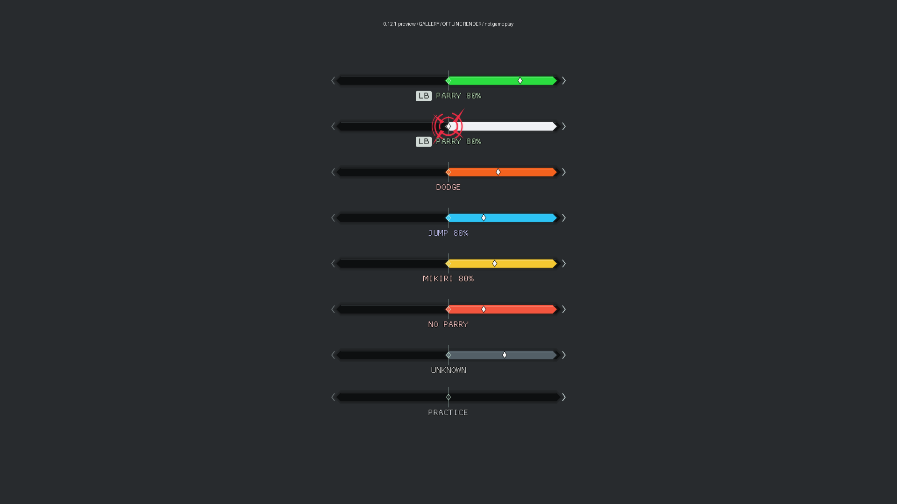
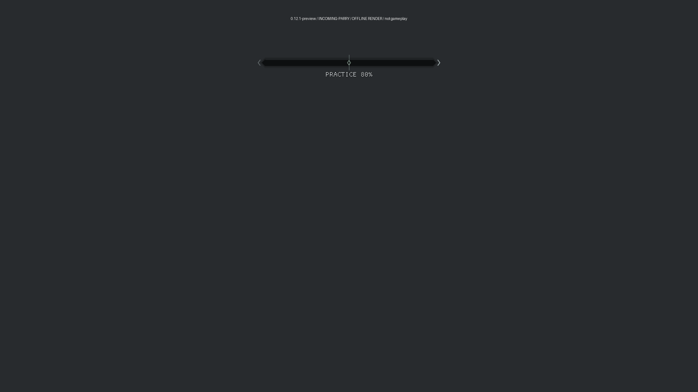

# Current visual reference

The 0.12.1 preview has two checked-in synthetic renders. Both use the shared HUD
drawing code. They are not gameplay screenshots.

The gallery stacks several states for review. Normal play shows one rail at a
time.

The second render verifies that `PRACTICE 80%` remains visible when the attack
label and attack-colored rail are disabled. It does not verify a live memory
write or measured slowdown.

See [HUD behavior and reproduction commands](cue-preview.md). Git history keeps
older design renders and gameplay frames without presenting them as the current
interface.
