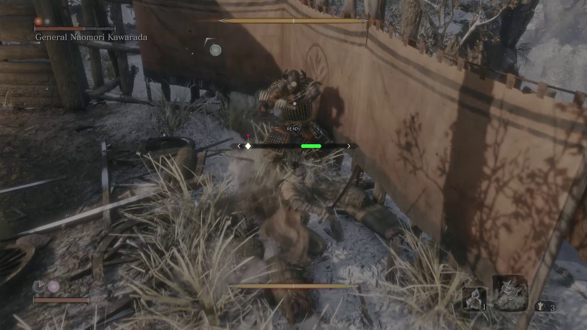
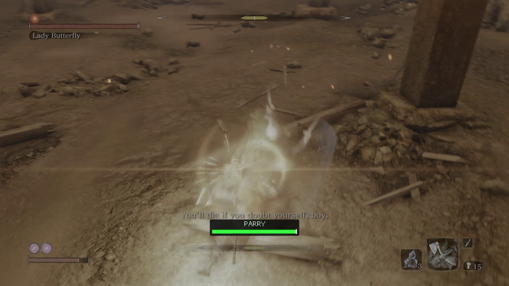
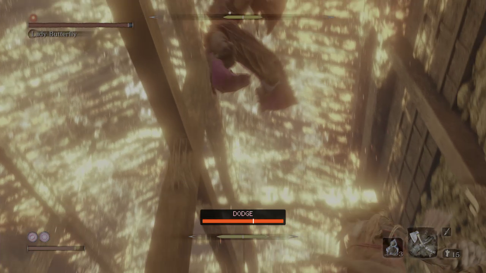

# Versioned visuals for the beta

## Current 0.12.1 practice and independent hints - synthetic previews


This uses the actual shared drawing code with synthetic target/controller states.
Eligible parryable, sweep and thrust states show 80%; excluded grabs, unknowns
and no-parry phases do not. The neutral PRACTICE caption indicates armed/waiting.
Only one rail appears during normal play. This is not evidence of a live speed
write, measured slowdown or successful defensive input.


Disabling attack hints leaves the applied-speed status visible as PRACTICE 80%.
See [feature boundaries](feature-boundaries.md) and [validation](validation-0.12.1.md).
Reproduce with the current source:

```powershell
cargo run --locked --offline --example cue-layout --target x86_64-pc-windows-msvc -- dist/review-0.12.1/layout/practice --incoming-gallery --practice
cargo run --locked --offline --example cue-layout --target x86_64-pc-windows-msvc -- dist/review-0.12.1/layout/no-hints --state incoming-parry --practice --no-hints
python scripts/render-cue-layout.py dist/review-0.12.1/layout/practice
python scripts/render-cue-layout.py dist/review-0.12.1/layout/no-hints
```

## User-provided gameplay recordings - September 16-17, 2026

These frames document the earlier on-screen behavior that prompted the UI changes.
The recording filenames establish their dates, but the clips do not identify a
DLL version or commit. They are historical gameplay evidence, not a live trial
of the current 0.12.1 UI, attack classification or speed practice. Compare them
with the explicitly synthetic current previews above; this is not a controlled
before/after gameplay comparison.

### Earlier rail during the General Naomori Kawarada fight



Source: `Sekiro 2026-09-16 11-34-12.mp4`, frame at **00:31.011467**.
The earlier rail appears across the middle of the scene, with a READY caption,
diamond and green segment. This shows the earlier design the user preferred;
the frame does not establish a successful deflect or a correct timing window.

### Reported larger overlay during the Lady Butterfly fight



Source: `Sekiro 2026-09-17 10-33-30.mp4`, frame at **00:11.004067**.
The green PARRY box sits near Wolf's lower posture bar and overlaps the subtitle
area. This records the larger lower-screen design reported by the user; it does
not show the current compact top HUD.



Same source, frame at **00:21.007767**. An orange DODGE label is visible. The
snapshot establishes that the prompt appeared, not that the attack was correctly
classified or that a dodge succeeded. Static frames cannot verify an 80% attack
rate, Wolf's unchanged speed, or restoration after a toggle or loss of focus.

### Extraction and provenance

The source videos remain local. The published PNGs retain the captured game
pixels at 1280 x 720: only the encoded black side padding was cropped from the
2560 x 720 video (`crop=1280:720:640:0`). There is no resizing, color correction,
annotation, generated artwork or replacement HUD in these gameplay frames.
[Frame provenance](images/user-recording-frames.json) records source/image SHA-256
hashes, the selected presentation timestamps and the crop. FFmpeg's normal video
decoding was used; this is not a measurement of the game's original color output.

Reproduce from the user's original recordings with FFmpeg 7.1 (select the first
frame at or after the requested time):

```powershell
$ffmpeg = 'dist/video-tools/imageio_ffmpeg/binaries/ffmpeg-win-x86_64-v7.1.exe'
& $ffmpeg -n -i 'C:/Users/mpati/Videos/Captures/Sekiro 2026-09-16 11-34-12.mp4' -vf 'select=gte(t\,31),crop=1280:720:640:0' -frames:v 1 -fps_mode vfr -update 1 'general-green.png'
& $ffmpeg -n -i 'C:/Users/mpati/Videos/Captures/Sekiro 2026-09-17 10-33-30.mp4' -vf 'select=gte(t\,11),crop=1280:720:640:0' -frames:v 1 -fps_mode vfr -update 1 'butterfly-parry.png'
& $ffmpeg -n -i 'C:/Users/mpati/Videos/Captures/Sekiro 2026-09-17 10-33-30.mp4' -vf 'select=gte(t\,21),crop=1280:720:640:0' -frames:v 1 -fps_mode vfr -update 1 'butterfly-dodge.png'
```

The historical rendering commands below require their matching older source.

## Historical 0.6.3 design - offline preview


This image is produced by the actual shared ImGui drawing code using synthetic
attack states. It shows the 0.6.3 filled diamond, needle, pointer, ribbon and
English action labels. It is not a screenshot of successful gameplay inputs.
No AI-generated replacement scene or promotional video thumbnail is used.

### Historical 0.6.3 action close-ups

These are native-scale renders of the shared overlay geometry into a smaller
documentation viewport. They are not retouched game screenshots or changes to
the game's timing window. Each image identifies itself as an offline render.

**Green PARRY** - current estimated deflect cue:


**Orange DODGE** - mapped grab response, without choosing a safe direction:


**Blue JUMP** - mapped low sweep response:


**TIMING UNVERIFIED** - gray segment and pointer with no confident action cue:


Reproduce:

```powershell
python -m pip install --target dist/video-tools Pillow
cargo run --locked --offline --example cue-layout --target x86_64-pc-windows-msvc -- dist/review-0.6.3/gallery --gallery
python scripts/render-cue-layout.py dist/review-0.6.3/gallery
foreach ($cueState in @('parry','dodge','jump','unverified')) {
    cargo run --locked --offline --example cue-layout --target x86_64-pc-windows-msvc -- "dist/review-0.6.3/details/$cueState" --state $cueState
    python scripts/render-cue-layout.py "dist/review-0.6.3/details/$cueState"
}
```

These image-export commands need the Rust development setup, Python 3 and Pillow.
They are not needed to install or run the mod.

The compact export retains a 16:9 camera/display. An initial tall-canvas attempt
was rejected by the projection checks; the export now reports empty geometry
explicitly instead of traversing an empty ImGui draw-list buffer.

## Earlier 0.6.0 gameplay - placement context


Unmodified frame image from the existing `gameplay-review-03.mp4` trial, previously
saved as `dist/game-analysis/gameplay-review-03-placement.jpg`. This demonstrates
the earlier overlay's in-game placement and neutral LOCKED state. It predates
the current visual design and does not verify 0.6.3 or drop-in startup.

## Earlier 0.5.0 gameplay - soldier PARRY frame


Extracted without visual alteration from `gameplay-review-02.mp4` at 21.033
seconds. The diamond is in the green zone and PARRY is visible. This is the
older, higher bar placement; it does not show the current 0.6.3 design or
independently establish contact timing or a successful player input.

## Earlier 0.6.0 gameplay - Chained Ogre reader trial


Extracted without visual alteration from `gameplay-review-04.mp4` at 24.000
seconds. This is a development-trial image: the target was detected, but the
older reader stayed neutral during the fight. The subsequent batch-reader
correction is documented in [the validation record](validation-0.6.md).
This screenshot is not evidence of a working Ogre DODGE or PARRY prompt.

The two added gameplay frames retain the recordings' 1920 x 1050 resolution.
The source recordings stay in the local `dist/game-analysis` folder, outside
the repository and runtime ZIP. No generated scene was substituted for gameplay.

Sekiro was closed when this gallery was prepared, so no new 0.6.3 live screenshot
was captured. Replace or supplement this historical image with a version-verified
gameplay capture after the next trial, retaining this provenance for reviewers.
