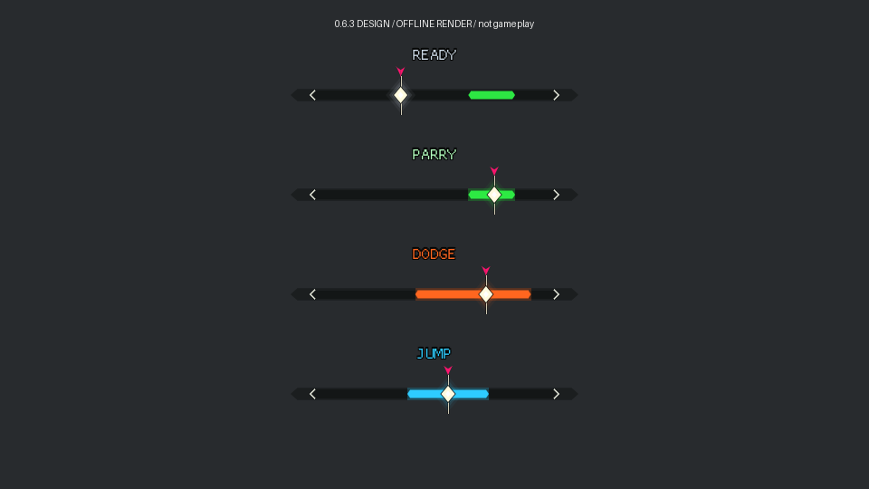
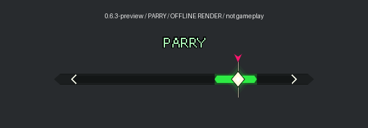
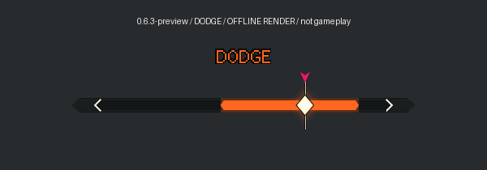
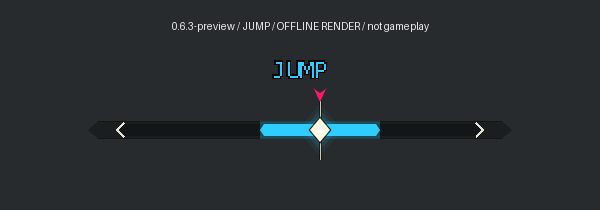
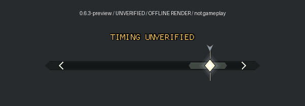
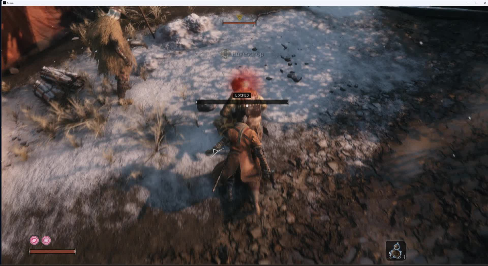
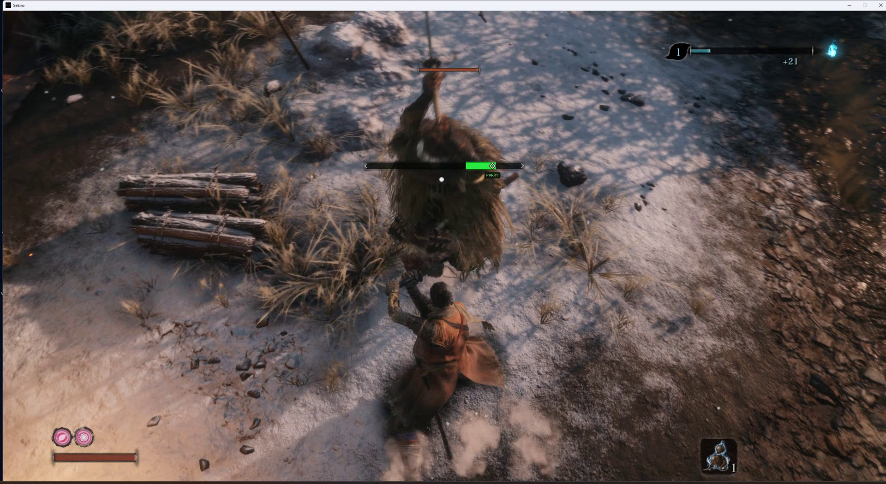
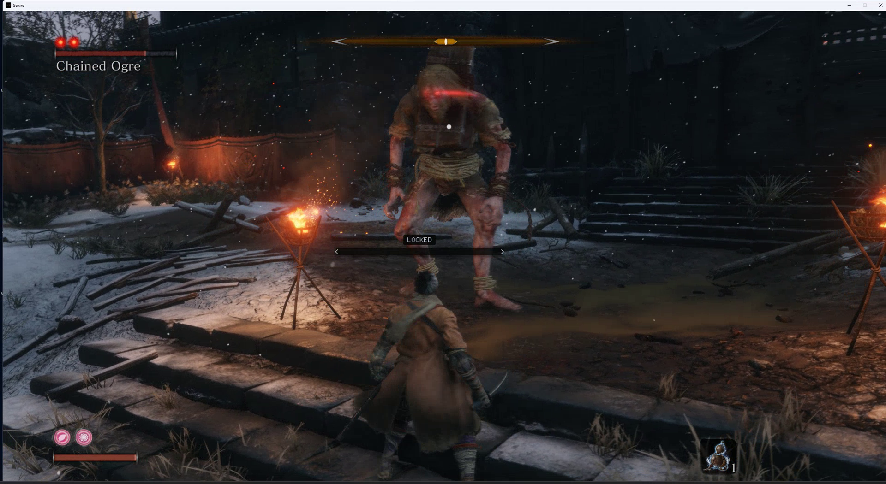

# Versioned visuals for the beta

## Current 0.6.3 design - offline preview



This image is produced by the actual shared ImGui drawing code using synthetic
attack states. It shows the current filled diamond, needle, pointer, ribbon and
English action labels. It is not a screenshot of successful gameplay inputs.
No AI-generated replacement scene or promotional video thumbnail is used.

### Current action close-ups

These are native-scale renders of the shared overlay geometry into a smaller
documentation viewport. They are not retouched game screenshots or changes to
the game's timing window. Each image identifies itself as an offline render.

**Green PARRY** - current estimated deflect cue:



**Orange DODGE** - mapped grab response, without choosing a safe direction:



**Blue JUMP** - mapped low sweep response:



**TIMING UNVERIFIED** - gray segment and pointer with no confident action cue:



Reproduce:

```powershell
python -m pip install --target dist/video-tools Pillow
cargo run --locked --offline --example cue-layout --target x86_64-pc-windows-msvc -- dist/review-0.6.3/gallery --gallery
python scripts/render-cue-layout.py dist/review-0.6.3/gallery
foreach ($cueState in @('parry','dodge','jump','unverified')) {
    cargo run --locked --offline --example cue-layout --target x86_64-pc-windows-msvc -- "dist/review-0.6.3/details/$cueState" --state $cueState
    python scripts/render-cue-layout.py "dist/review-0.6.3/details/$cueState"
}
```

These image-export commands need the Rust development setup, Python 3 and Pillow.
They are not needed to install or run the mod.

The compact export retains a 16:9 camera/display. An initial tall-canvas attempt
was rejected by the projection checks; the export now reports empty geometry
explicitly instead of traversing an empty ImGui draw-list buffer.

## Earlier 0.6.0 gameplay - placement context



Unmodified frame image from the existing `gameplay-review-03.mp4` trial, previously
saved as `dist/game-analysis/gameplay-review-03-placement.jpg`. This demonstrates
the earlier overlay's in-game placement and neutral LOCKED state. It predates
the current visual design and does not verify 0.6.3 or drop-in startup.

## Earlier 0.5.0 gameplay - soldier PARRY frame



Extracted without visual alteration from `gameplay-review-02.mp4` at 21.033
seconds. The diamond is in the green zone and PARRY is visible. This is the
older, higher bar placement; it does not show the current 0.6.3 design or
independently establish contact timing or a successful player input.

## Earlier 0.6.0 gameplay - Chained Ogre reader trial



Extracted without visual alteration from `gameplay-review-04.mp4` at 24.000
seconds. This is a development-trial image: the target was detected, but the
older reader stayed neutral during the fight. The subsequent batch-reader
correction is documented in [the validation record](validation-0.6.md).
This screenshot is not evidence of a working Ogre DODGE or PARRY prompt.

The two added gameplay frames retain the recordings' 1920 x 1050 resolution.
The source recordings stay in the local `dist/game-analysis` folder, outside
the repository and runtime ZIP. No generated scene was substituted for gameplay.

Sekiro was closed when this gallery was prepared, so no new 0.6.3 live screenshot
was captured. Replace or supplement this historical image with a version-verified
gameplay capture after the next trial, retaining this provenance for reviewers.
