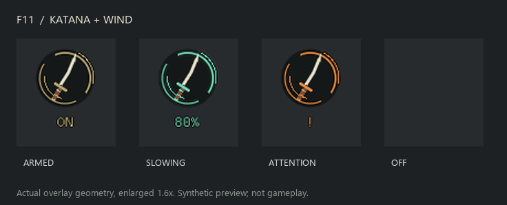

# 0.12.2-preview validation

This release adds a persistent practice status crest to the upper-right corner
of the playable viewport. It draws without a target and does not change attack
classification, practice eligibility, memory writes or restoration policy.



## Checks performed

- All 133 Windows MSVC tests passed, including practice, layout and DX11 host
  graphics-state isolation checks.
- Clippy with `-D warnings`, formatting, and the Windows release build passed.
  Vendored hudhook retains its two existing unused-method warnings.
- Shared ImGui mesh previews verified armed, active, paused, unavailable,
  unsupported, pending-restoration and off states without an attack cue.
  Off and F8-style hidden previews produce zero geometry.
- Every indicator vertex stayed inside the measured bounds and playable
  viewport at 1280x720, 1920x1080, 5120x1440 and 3840x2160, each at HUD scales
  0.5, 1.0 and 2.0. The reduced-flash preview also passed.
- The actual compiled drawing was rasterized and visually inspected at 1080p;
  the gallery above shows enlarged crops of those renders.
- The isolated ASI loader smoke check passed for DirectInput forwarding,
  adjacent DLL loading and non-Sekiro host rejection.
- The release ZIP was extracted into `Mods/SekiroDeflectObserver-0.12.2-preview`;
  every extracted payload matched its packaged SHA-256 checksum.

## Reproduce the indicator preview

```powershell
cargo run --locked --offline --example cue-layout --target x86_64-pc-windows-msvc -- dist/review-0.12.2/layout/armed-only --indicator-only --indicator armed
python scripts/render-cue-layout.py dist/review-0.12.2/layout/armed-only
```

Other `--indicator` values: `active`, `paused`, `unavailable`, `unsupported`,
`pending`, `off`. Add `--hidden` to verify master visibility or
`--reduced-flash` to omit the active glow. `--display 5120 1440` checks the
ultrawide surface with a centered 16:9 playable viewport.

## Live check

Restart using the 0.12.2 profile, then press F11 with the HUD visible. Verify
gold `ON` without a lock, jade with the applied percentage on eligible attacks,
and disappearance when F11 is disabled or F8 hides the HUD. F9 explains amber
`!` states. Pending restoration may retain that warning after F11 is disabled.

The new DLL was not injected into the already-running game. Synthetic previews
and memory-fixture tests do not establish live placement or measured slowdown.
The existing [practice gameplay checklist](enemy-speed-practice.md#live-check-still-needed)
still applies.
