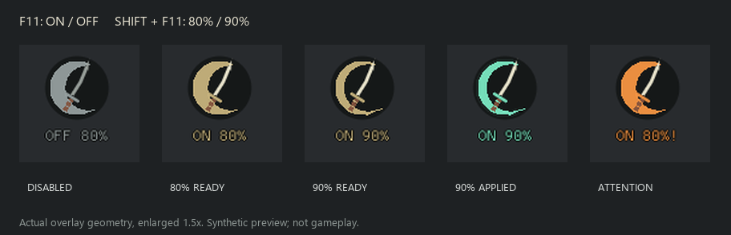

# 0.12.3-preview validation

F11 remains on/off. Shift+F11 switches and saves 80% / 90% speed. The persistent
crescent-and-katana badge reports OFF/ON and selected speed, including without
a target. Color distinguishes off, armed, applied and attention states.



All 136 Windows MSVC tests passed, including shortcut repeat/key-up handling,
persisted speed changes and external-file conflicts, switching 80%/90% without
stacking, existing speed-restoration checks, layout and DX11 state isolation.
Formatting, Clippy with `-D warnings`, the release build and isolated ASI loader
smoke check also passed. The loader check covers DirectInput forwarding,
adjacent DLL loading and rejection of a non-Sekiro host. Vendored hudhook keeps
its two existing unused-method warnings.

Shared renderer previews cover both speeds in off, armed, active, paused,
unavailable, unsupported and pending-restoration states. Bounds checks cover
720p, 1080p, 5120x1440 and 4K at scales 0.5, 1 and 2, plus hidden and reduced-flash
states. The selected percentage remains visible while off; hidden HUDs emit no
badge geometry. Actual compiled geometry is rasterized for visual inspection.

Reproduce a 90% preview:

```powershell
cargo run --locked --offline --example cue-layout --target x86_64-pc-windows-msvc -- dist/review-0.12.3/layout/armed-0.9 --indicator-only --indicator armed --speed 0.9
python scripts/render-cue-layout.py dist/review-0.12.3/layout/armed-0.9
```

Live verification of the new shortcuts and indicator requires a full restart
with the 0.12.3 profile. Check OFF 80%, Shift+F11 to OFF 90%, F11 to ON 90%,
jade during a recognized attack, and Shift+F11 back to ON 80%. Restart should
retain the selected percentage but reset to OFF. F8 still hides and disarms.

These preview checks do not establish in-game icon placement or 90% animation
timing. The broader [gameplay checks](enemy-speed-practice.md#live-check-still-needed)
still apply.
